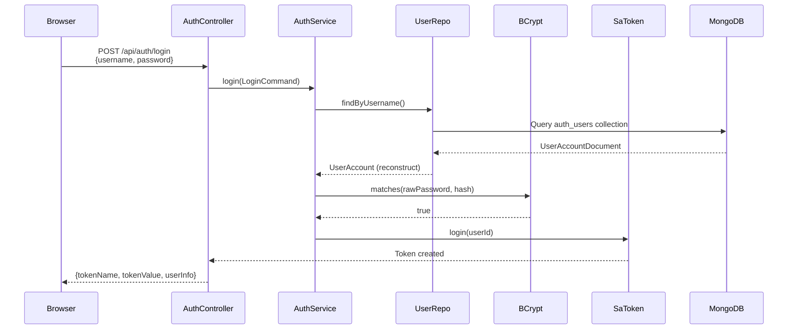
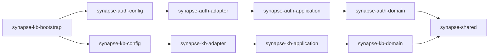

# 架构概览

## 模块结构

```
synapse/
├── synapse-shared/              # 共享内核（DomainException）
├── synapse-auth-domain/         # 认证领域层 —— 用户、角色、权限
├── synapse-auth-application/    # 认证应用层 —— 登录、当前用户、用户/角色管理
├── synapse-auth-adapter/        # 认证适配器层 —— Web、Mongo、Sa-Token、BCrypt
├── synapse-auth-config/         # 认证 Bean 组装与安全过滤器
├── synapse-kb-domain/           # 知识库领域层 —— 纯 Java，零框架依赖
├── synapse-kb-application/      # 知识库应用层 —— 用例编排，定义端口
├── synapse-kb-adapter/          # 知识库适配器层 —— Web、Mongo、Milvus、Ollama、Tika
├── synapse-kb-config/           # 知识库 Bean 组装
├── synapse-kb-bootstrap/        # Spring Boot 启动入口
└── synapse-frontend/            # Vue 3 + Vite + Pinia 前端
```

## 依赖方向（绝对不能违反）

```
shared ← domain ← application ← adapter ← config ← bootstrap
```

这个箭头表示**依赖方向**：外层模块可以依赖内层，内层模块绝对不能依赖外层。

- `domain` 层是核心，没有任何外部框架依赖
- `application` 层只依赖 `domain` 和端口接口
- `adapter` 层实现端口，引入具体技术（Spring、MongoDB、Milvus 等）
- `config` 层负责把所有东西组装起来
- `bootstrap` 层只有一个 `@SpringBootApplication`

<Warning>
  依赖方向向内是 DDD 分层架构的**铁律**。如果你发现 Domain 层里出现了 `import org.springframework.*`，那就是架构腐化的信号。
</Warning>

## 两个 Bounded Context

`auth` 和 `kb` 是并列的两个限界上下文（Bounded Context）：

- **auth**：负责登录、会话、用户管理、角色权限
- **kb**：负责知识库、文档、问答、聊天记忆

`kb-application` 只能通过 `AccessControlPort` 依赖权限能力。具体的 Sa-Token 实现在 `auth-adapter` 中，kb 模块对此一无所知。

```
kb-application ──AccessControlPort──> auth-adapter (SaTokenAccessControlAdapter)
```

## 一条请求的完整旅程

让我们跟着一次**登录请求**，看看数据如何从浏览器流动到数据库，再返回到浏览器。

### 登录请求



**每一层的职责：**

| 层级 | 在这个请求中做了什么 |
|------|---------------------|
| **Browser** | 发送 POST 请求，携带账号密码 |
| **AuthController** (Adapter-In) | 接收 HTTP 请求，把 JSON 转成 DTO，调用 Application Service |
| **AuthApplicationService** (Application) | 校验参数 → 查用户 → 验密码 → 创建会话 → 聚合权限 |
| **UserAccount** (Domain) | 封装用户状态和校验规则（密码哈希非空、用户名长度限制等） |
| **MongoUserAccountRepository** (Adapter-Out) | 把领域实体转成 MongoDB Document，执行查询，再转回实体 |
| **BCryptPasswordHasherAdapter** (Adapter-Out) | 用 Spring Security Crypto 比对密码 |
| **SaTokenLoginSessionAdapter** (Adapter-Out) | 调用 `StpUtil.login()` 创建会话 |

### 问答请求（更复杂的链路）

```mermaid
sequenceDiagram
    participant Browser
    participant StreamingQueryController
    participant QueryUseCase
    participant SessionRepo
    participant QueryRewrite
    participant VectorSearch
    participant KeywordSearch
    participant LLM

    Browser->>StreamingQueryController: POST /query/stream<br/>{query, sessionId}
    StreamingQueryController->>QueryUseCase: prepare(query)
    QueryUseCase->>SessionRepo: getOrCreateSession()
    QueryUseCase->>QueryRewrite: rewrite(query)
    QueryRewrite->>QueryUseCase: rewrittenQuery (or original)
    
    par 并行执行
        QueryUseCase->>VectorSearch: search(embedding)
        VectorSearch->>Milvus: ANN search
        Milvus-->>VectorSearch: Top-K chunks
    and
        QueryUseCase->>KeywordSearch: search(keywords)
        KeywordSearch->>MongoDB: BM25 search
        MongoDB-->>KeywordSearch: Top-K chunks
    end
    
    QueryUseCase->>QueryUseCase: mergeAndRerank()
    QueryUseCase->>QueryUseCase: buildPrompt()
    QueryUseCase-->>StreamingQueryController: RagContext
    StreamingQueryController->>LLM: generateStream(prompt)
    LLM-->>StreamingQueryController: Stream&lt;token&gt;
    StreamingQueryController-->>Browser: SSE events
```

这个链路展示了本项目的几个关键技术点：

1. **Query 改写**：先尝试优化用户问题，再用 embedding 相似度校验质量
2. **混合检索并行**：向量检索和关键词检索用 `CompletableFuture` 同时执行
3. **融合重排**：两种检索结果加权排序，得到最终 Top-K
4. **SSE 流式**：LLM 生成一个字，前端立刻显示一个字

## 为什么 Application 层是同步的？

你可能会问：WebFlux 是异步的，为什么 Application Service 返回普通对象而不是 `Mono<T>`？

这是**刻意的架构决策**。五个原因：

| 原因 | 说明 |
|------|------|
| **零框架依赖** | Domain 层禁止引入 Spring、Reactor。如果 Application 返回 Mono，Domain 就被迫理解 Mono |
| **业务是决策流** | 查重 → 创建 → 保存 → 解析 → 分块 → 向量化 → 存储。严格串行，没有并行必要 |
| **Reactive 解决 I/O** | Controller、MongoDB、Ollama 都是 I/O。这些是 Adapter 的技术细节，Application 不该知道 |
| **可测试性** | 同步 API 的单元测试干净直接。Mono 需要 StepVerifier、调度器——复杂度翻倍 |
| **依赖方向保护** | domain ← application ← adapter。Application 依赖 Reactor 会破坏向内指向 domain 的规则 |

Reactive 的边界是这样的：

```
[浏览器] ──HTTP──► [Controller: Mono/Flux]      ←── 线程不阻塞
                           │
                           ▼
                [Application Service: 同步]         ←── 业务逻辑纯净
                           │
                           ▼
                [Adapter Out: Mono/Flux]            ←── MongoDB、Ollama
                           │
                           ▼
                     .block()                        ←── 桥接
```

Adapter 消化技术复杂性，Application 只面对纯净的 Java 对象。

## 启动流程



1. Spring Boot 扫描 `synapse-kb-bootstrap` 启动
2. 加载 `synapse-auth-config` 和 `synapse-kb-config` 中的 `@Configuration`
3. Config 层创建 Application Service Bean，注入 Repository/Port 实现
4. Adapter 层的 `@Component` 被 Spring 扫描注册
5. `AuthDataInitializer` 在启动时初始化默认角色和 admin 用户
6. `IngestionJobWorker` 开始定时轮询后台任务

<Tip>
  理解这个架构的关键是：**每一层只关心自己这一层的事情**。Controller 不关心密码怎么哈希，Domain 不关心 HTTP 怎么工作，Application 不关心 MongoDB 怎么查询。这种隔离让代码易于理解、测试和修改。
</Tip>
