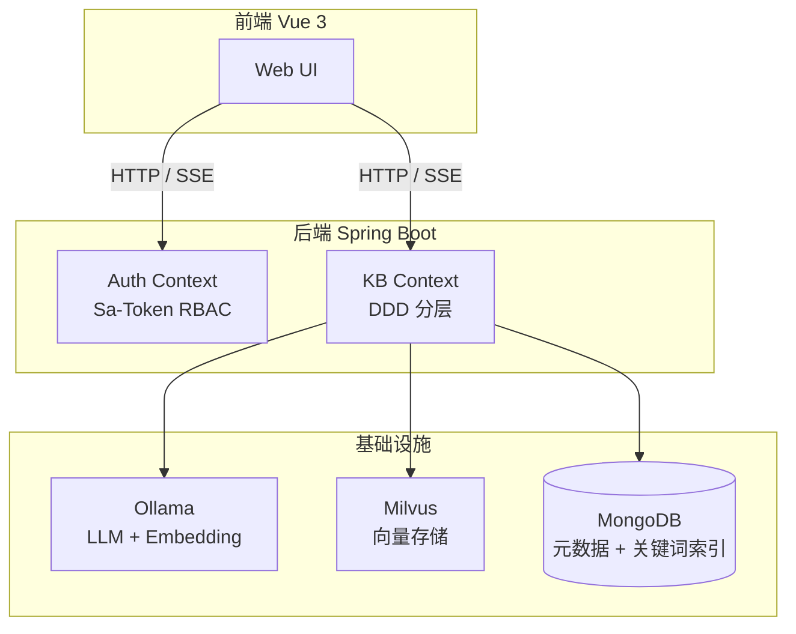

# Synapse

Synapse 是一个面向企业的**多知识库 RAG（Retrieval-Augmented Generation）系统**。它允许用户创建多个独立的知识库，上传文档（PDF、Word、TXT、Markdown 等），然后通过自然语言问答的方式与知识库进行交互。

但这个文档站点不只是"产品说明书"。**我们的目标是：让你通过阅读这些文档，学会构建这个系统的所有技术。**

## 你能从中学到什么

读完这个文档，你将理解并能在自己的项目中运用以下技术：

| 技术领域 | 具体技能 |
|---------|---------|
| **RAG 检索增强生成** | 向量检索、关键词检索、混合检索、Query 改写、Prompt 工程 |
| **领域驱动设计（DDD）** | 充血模型、聚合根、值对象、仓储模式、领域服务 |
| **六边形架构** | 端口适配器模式、依赖方向控制、分层边界 |
| **Spring WebFlux** | Reactive 编程、Mono/Flux、SSE 流式输出、非阻塞 I/O |
| **AI 工程化** | LangChain4j 集成、Ollama 本地部署、Embedding 模型调用 |
| **向量数据库** | Milvus 集合设计、HNSW 索引、向量相似度搜索 |
| **权限系统** | Sa-Token RBAC、角色权限模型、Reactor 上下文桥接 |
| **Vue 3 前端工程** | Pinia 状态管理、SSE 手动解析、TypeScript 类型设计 |

## 核心特性

- **多知识库隔离**：每个知识库独立管理文档和向量数据，严格的用户归属隔离
- **完整 RBAC 权限**：基于 Sa-Token 的角色权限控制，支持 `USER` 和 `ADMIN` 角色
- **异步文档摄入**：上传后立即返回，后台完成解析、分块、向量化全流程
- **混合检索**：Milvus 向量召回 + MongoDB BM25 关键词召回，融合重排
- **Query 改写质量门禁**：通过 embedding 余弦相似度校验改写质量，保障检索准确性
- **SSE 流式问答**：打字机效果实时输出，支持引用溯源
- **聊天记忆**：会话历史压缩摘要，支持多轮对话上下文

## 系统架构概览

## 学习路径

我们推荐按以下顺序学习：

<CardGroup cols={2}>
  <Card title="1. 快速上手" icon="rocket" href="/01-getting-started/quickstart">
    15 分钟把项目跑起来，先当用户用一遍
  </Card>
  <Card title="2. 核心概念" icon="lightbulb" href="/02-core-concepts/what-is-rag">
    理解 RAG、向量检索、DDD 的基本概念
  </Card>
  <Card title="3. 纵向切片" icon="code" href="/03-vertical-slices/slice-01-auth/story">
    跟着完整的用户故事，从 HTTP 到数据库逐层拆解
  </Card>
  <Card title="4. 横向深入" icon="book-open" href="/04-horizontal-deepdive/domain-patterns">
    学完所有切片后，横向比较设计模式
  </Card>
  <Card title="5. 动手实践" icon="wrench" href="/05-practice/debug-setup">
    添加功能、换模型、调试技巧
  </Card>
  <Card title="6. API 参考" icon="code" href="/07-reference/api/authentication">
    完整的接口文档，含 curl 示例
  </Card>
</CardGroup>

## 适用场景

- **企业内部知识管理**：产品手册、技术文档、规章制度的统一检索与问答
- **个人知识库**：论文、笔记、资料的整理与智能检索
- **学习本项目**：通过真实项目学习 RAG、DDD、Reactive 编程等现代技术栈

## 技术栈速览

| 层级 | 技术 | 版本 |
|------|------|------|
| 后端框架 | Spring Boot + WebFlux | 3.5.13 |
| 鉴权 | Sa-Token Reactor | 1.45.0 |
| AI 编排 | LangChain4j | 1.13.0 |
| LLM / Embedding | Ollama | qwen2.5:7b / gme-Qwen2-VL-2B |
| 向量存储 | Milvus | 2.3+ |
| 元数据存储 | MongoDB | 6.0+ |
| 文档解析 | Apache Tika | — |
| 前端 | Vue 3 + Vite + Pinia | — |
| 构建工具 | Maven | Java 21 |

<Tip>
  本项目采用**纵向切片**的学习方式：每个章节跟着一个完整的用户故事，从浏览器的 HTTP 请求开始，穿过 Controller、Application Service、Domain Model、Repository，直到数据库。这样你始终有上下文，不会迷失在零散的技术细节中。
</Tip>
