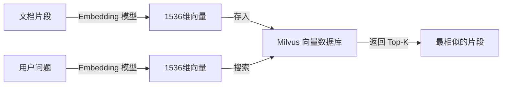

# 向量检索

## 为什么关键词搜索不够

想象你在找一篇关于"苹果"的文档。关键词搜索会找到所有包含"苹果"这个词的文档。但问题是：

- "苹果"可以指水果，也可以指公司
- "iPhone"和"苹果手机"是同一个东西，但关键词搜索不会把"iPhone"和"苹果"关联起来
- "怎么重启手机"和"手机开不了机怎么办"意思一样，但关键词完全不同

**关键词搜索只匹配字面，不理解语义。**

## 向量是什么

向量就是**一组数字**。比如：

```
[0.12, -0.45, 0.89, ..., 0.33]  ← 一共 1536 个数字
```

在向量检索中，每个文本（一个句子、一段话）都会被转换成一个向量。转换的工具叫做 **Embedding 模型**。

### Embedding 模型做了什么

Embedding 模型是一个神经网络，它的输入是文本，输出是一个向量。训练过程中，模型学会了：**语义相近的文本，向量也相近**。

| 文本 | 向量表示 | 和其他文本的关系 |
|------|---------|-----------------|
| "苹果手机" | 向量 A | 和"iPhone"的向量很接近 |
| "iPhone" | 向量 B | 和"苹果手机"的向量很接近 |
| "苹果水果" | 向量 C | 和"香蕉"的向量很接近，和"苹果手机"的向量很远 |

所以，即使"苹果手机"和"iPhone"字面完全不同，它们的向量却非常接近。这就是语义检索的核心。

## 向量相似度怎么计算

给定两个向量，怎么判断它们有多"像"？

### 余弦相似度

最常用的方法是**余弦相似度**。想象两个向量是从原点出发的箭头：

- 两个箭头方向越接近（夹角越小），余弦相似度越高（接近 1）
- 两个箭头方向垂直（夹角 90 度），余弦相似度为 0
- 两个箭头方向相反（夹角 180 度），余弦相似度为 -1

```
    向量 A
      \
       \
        \  θ（夹角）
         \
          向量 B
```

在文本检索中，余弦相似度通常在 0 到 1 之间。0.8 以上通常认为是高度相似。

Synapse 的 Query 改写质量门禁就用到了这个阈值：改写后的问题和原问题的 embedding 余弦相似度必须 ≥ 0.8，否则回退。

## 向量数据库

既然要比较向量相似度，为什么不直接在内存里比较？

### 暴力搜索的问题

假设你有 100 万条文档片段，每条是一个 1536 维的向量。用户提问时，你需要计算问题向量与 100 万个文档向量的余弦相似度，找出最接近的 K 个。

100 万次 × 1536 维的计算，在毫秒级完成是不可能的。随着数据量增长，查询时间会线性增长。

### 近似最近邻（ANN）

向量数据库使用 **ANN（Approximate Nearest Neighbor）** 算法，牺牲一点点精度，换取极大的速度提升。

Synapse 使用的 Milvus 采用 **HNSW（Hierarchical Navigable Small World）** 索引：

**比喻：导航层级**

想象你在一个大城市找人：

- **最上层**：只看高速公路，快速定位到大致区域
- **中间层**：看主干道，进一步缩小范围
- **最底层**：看小巷子，精确找到目标

HNSW 建立多层图结构，查询时从顶层快速跳跃，逐层深入，最终找到近似最近的邻居。查询时间和数据量不是线性关系，而是对数关系——即使上亿条向量，也能在几十毫秒内完成。

## 向量维度

Synapse 使用的 Embedding 模型（gme-Qwen2-VL-2B）输出 **1536 维**向量。这意味着每个文本被表示为 1536 个浮点数。

维度越高，表示能力越强（能区分更细微的语义差异），但存储和计算成本也越高。1536 维是一个常见的平衡点。

<Warning>
  **切换 Embedding 模型时必须重建向量索引**。因为不同模型输出的向量维度可能不同（比如 768 维 vs 1536 维），而且不同模型的向量空间完全不兼容（同一个文本在模型 A 和模型 B 中的向量完全不一样）。如果你换了模型，之前存入 Milvus 的所有向量都要重新生成。
</Warning>

## Synapse 中的向量使用

在 Synapse 中，向量出现在三个环节：

1. **文档摄入**：每个文档片段被 Embedding 模型转成 1536 维向量，存入 Milvus
2. **问答检索**：用户问题也被转成向量，在 Milvus 中搜索最相似的文档片段向量
3. **Query 改写校验**：比较改写前后的向量相似度，判断是否回退



## 本章自检清单

读完这一章，你应该能回答：

- [ ] 为什么关键词搜索理解不了"苹果手机"和"iPhone"的关系？
- [ ] Embedding 模型的核心作用是什么？
- [ ] 余弦相似度的直觉含义是什么？（夹角越小越相似）
- [ ] 为什么需要向量数据库，而不是内存暴力搜索？
- [ ] HNSW 索引的基本思想是什么？
- [ ] 切换 Embedding 模型为什么必须重建索引？
