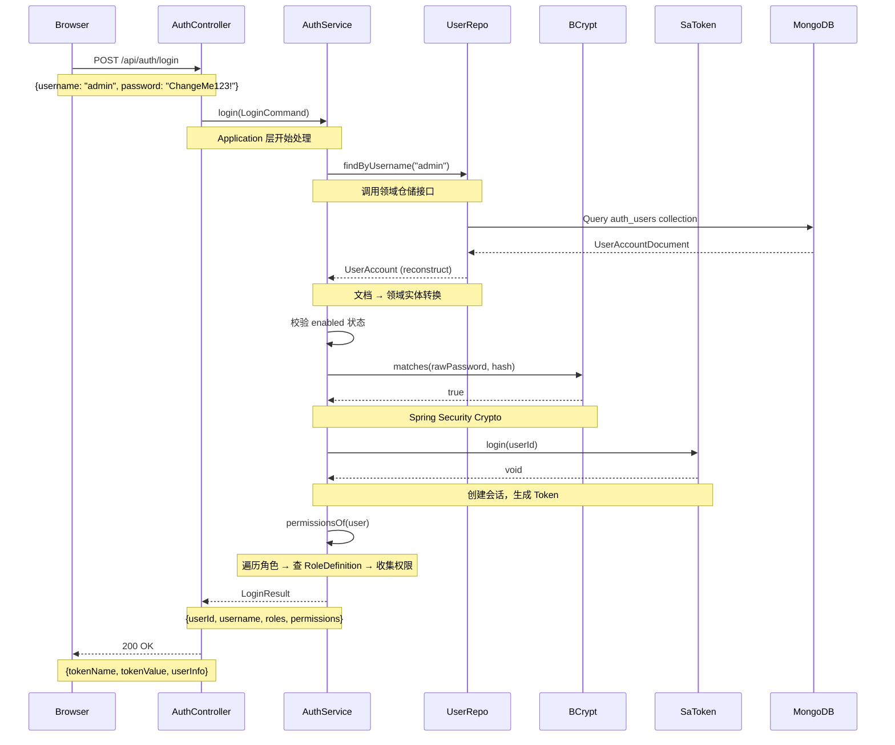
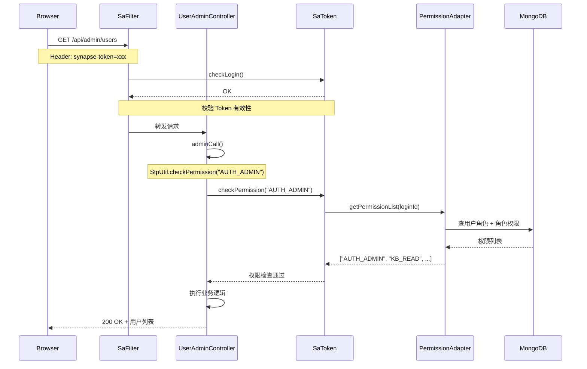

# 认证登录 —— 完整链路

## 登录请求时序图



## 后续请求鉴权流

登录成功后，后续请求需要携带 Token。系统怎么知道这个请求是谁发的？



## 代码路径标注

### 登录请求的代码路径

| 步骤 | 代码位置 | 作用 |
|------|---------|------|
| 1 | `AuthController.java` | 接收 HTTP POST 请求，解析 JSON |
| 2 | `AuthController.java:login()` | 调用 `SaTokenReactorBridge.blockingCall()` |
| 3 | `AuthApplicationService.java:login()` | 校验参数非空 |
| 4 | `AuthApplicationService.java:login()` | 调用 `userRepository.findByUsername()` |
| 5 | `MongoUserAccountRepository.java:findByUsername()` | 调用 Spring Data 查询 |
| 6 | `MongoUserAccountRepository.java:toEntity()` | Document → `UserAccount.reconstruct()` |
| 7 | `AuthApplicationService.java:login()` | 校验 `enabled` 状态 |
| 8 | `AuthApplicationService.java:login()` | 调用 `passwordHasher.matches()` |
| 9 | `BCryptPasswordHasherAdapter.java:matches()` | `BCryptPasswordEncoder.matches()` |
| 10 | `AuthApplicationService.java:login()` | 调用 `loginSession.login()` |
| 11 | `SaTokenLoginSessionAdapter.java:login()` | `StpUtil.login(userId.value())` |
| 12 | `AuthApplicationService.java:login()` | 调用 `permissionsOf(user)` |
| 13 | `AuthApplicationService.java:permissionsOf()` | 遍历角色 → 查 `RoleDefinition` → 收集 `AuthPermission` |
| 14 | `AuthApplicationService.java:login()` | 组装 `LoginResult` |
| 15 | `AuthController.java:login()` | 组装 `LoginResponse`（含 tokenName + tokenValue） |

### 后续请求鉴权的代码路径

| 步骤 | 代码位置 | 作用 |
|------|---------|------|
| 1 | `SaTokenSecurityConfig.java` | `SaReactorFilter` 拦截 `/api/**`（排除 `/api/auth/login`） |
| 2 | `SaTokenSecurityConfig.java` | `StpUtil.checkLogin()` 校验 Token |
| 3 | `UserAdminController.java` | `adminCall()` 封装权限检查 |
| 4 | `UserAdminController.java` | `StpUtil.checkPermission("AUTH_ADMIN")` |
| 5 | `SaTokenPermissionAdapter.java:getPermissionList()` | 查用户 → 查角色 → 收集权限 |

## 关键设计决策

### 为什么用户名和密码错误用同一个提示？

```java
// 故意不区分"用户名不存在"和"密码错误"
UserAccount user = userRepository.findByUsername(command.username().trim())
    .orElseThrow(() -> new DomainException("用户名或密码错误"));
if (!user.isEnabled() || !passwordHasher.matches(command.password(), user.getPasswordHash())) {
    throw new DomainException("用户名或密码错误");
}
```

如果分别提示"用户名不存在"和"密码错误"，攻击者可以通过枚举用户名来判断哪些用户存在。统一提示是一种**安全设计**。

### 为什么密码要哈希存储？

```java
// 数据库里存的是哈希值，不是明文密码
String passwordHash = passwordHasher.hash(rawPassword);
// 比对时也是比对哈希
boolean matches = passwordHasher.matches(rawPassword, passwordHash);
```

即使数据库泄露，攻击者拿到的是哈希值，无法直接知道原始密码。BCrypt 还加了 salt，进一步增加破解难度。

### 为什么用 `SaTokenReactorBridge.blockingCall()`？

```java
@PostMapping("/login")
public Mono<LoginResponse> login(@RequestBody LoginRequest request) {
    return SaTokenReactorBridge.blockingCall(() -> {
        // 同步的 Application Service 调用
        LoginResult result = authenticationUseCase.login(...);
        return new LoginResponse(...);
    });
}
```

Sa-Token 的 `StpUtil` 是同步 API，但 Controller 需要返回 `Mono`。`blockingCall()` 把同步调用放到弹性线程池（`Schedulers.boundedElastic()`）中执行，避免阻塞 Netty 事件循环线程。

这是 WebFlux 项目中使用同步库的**标准模式**。

## 本章自检清单

读完这一章，你应该能回答：

- [ ] 登录请求经过了哪些层？每层做了什么？
- [ ] 后续请求的 Token 是怎么被校验的？
- [ ] 为什么用户名和密码错误不分别提示？
- [ ] `SaTokenReactorBridge` 的作用是什么？
- [ ] `permissionsOf()` 方法是怎么从角色得到权限列表的？
