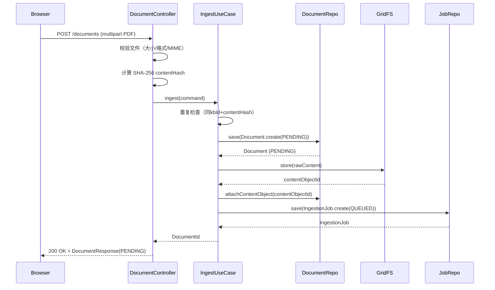
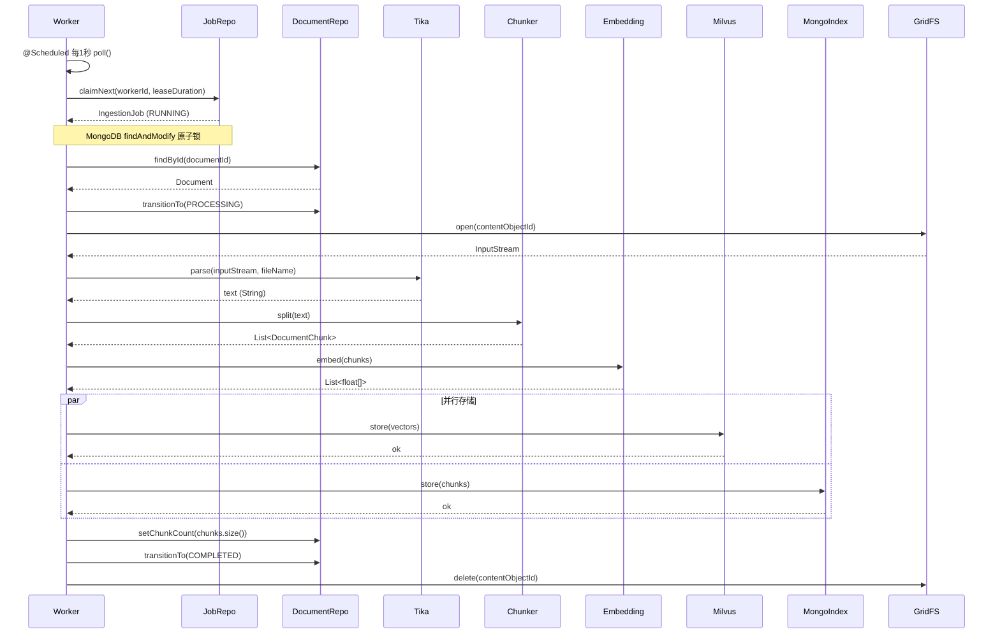
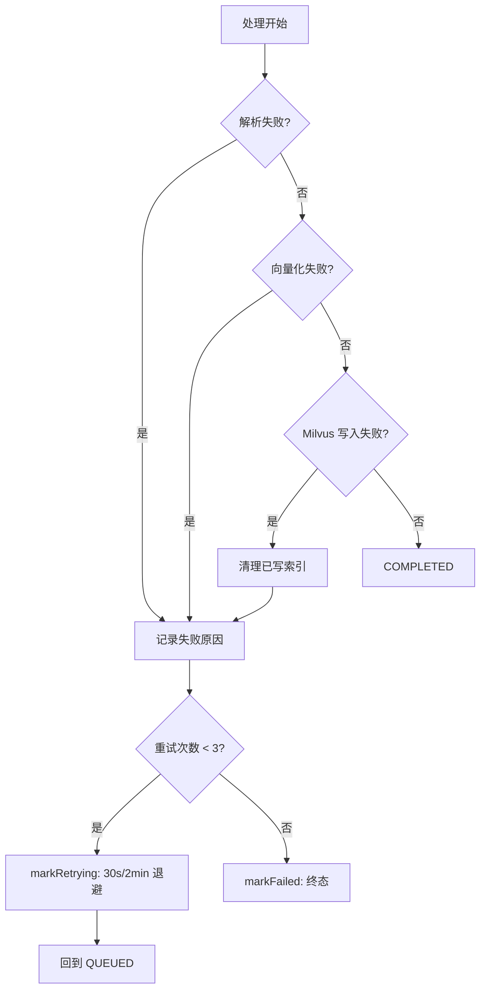

# 文档上传与摄入 —— 完整链路

文档摄入分为两个阶段：**同步上传阶段**和**异步处理阶段**。

## 阶段1：同步上传



### 关键设计：为什么分两步？

1. **用户体验**：上传大文件可能需要几秒，如果等处理完再返回，用户会以为系统卡死了
2. **资源隔离**：上传是网络 I/O，处理是 CPU/GPU 密集型，分开可以避免互相影响
3. **可恢复性**：如果处理失败，用户可以看到失败原因，选择重试

## 阶段2：异步处理



### 失败处理流程



## 代码路径标注

### 同步上传阶段

| 步骤 | 代码位置 | 作用 |
|------|---------|------|
| 1 | `DocumentController.java:upload()` | 接收 multipart 请求，用 `DataBufferUtils.join()` 读取文件 |
| 2 | `DocumentController.java:upload()` | 校验文件大小、扩展名、Content-Type |
| 3 | `DocumentController.java:upload()` | SHA-256 计算 contentHash |
| 4 | `KnowledgeBaseApplicationService.java:ingest()` | 重复内容检查（同 kbId + contentHash） |
| 5 | `KnowledgeBaseApplicationService.java:ingest()` | `Document.create()` 创建 PENDING 文档 |
| 6 | `KnowledgeBaseApplicationService.java:ingest()` | `documentContentStorePort.store()` 存 GridFS |
| 7 | `KnowledgeBaseApplicationService.java:ingest()` | `document.attachContentObject(contentObjectId)` |
| 8 | `KnowledgeBaseApplicationService.java:ingest()` | `documentRepository.save(document)` |
| 9 | `KnowledgeBaseApplicationService.java:ingest()` | `ingestionJobRepository.save(IngestionJob.create())` |

### 异步处理阶段

| 步骤 | 代码位置 | 作用 |
|------|---------|------|
| 1 | `IngestionJobWorker.java:poll()` | `@Scheduled` 定时触发 |
| 2 | `MongoIngestionJobRepository.java:claimNext()` | `findAndModify` 原子锁认领任务 |
| 3 | `KnowledgeBaseApplicationService.java:runIngestionTask()` | 获取文档并处理 |
| 4 | `KnowledgeBaseApplicationService.java:processDocument()` | `transitionTo(PROCESSING)` |
| 5 | `KnowledgeBaseApplicationService.java:parseDocumentChunks()` | `documentContentStorePort.open()` 读取 GridFS |
| 6 | `ApacheTikaDocumentParserAdapter.java:parse()` | Tika 解析文档 |
| 7 | `RecursiveChunkingStrategy.java:split()` | 语义分块 |
| 8 | `OllamaEmbeddingAdapter.java:embed()` | Ollama 向量化 |
| 9 | `MilvusVectorStoreAdapter.java:store()` | 存储向量 |
| 10 | `MongoChunkSearchIndexAdapter.java:store()` | 存储 BM25 索引 |
| 11 | `KnowledgeBaseApplicationService.java:processDocument()` | `setChunkCount()` + `transitionTo(COMPLETED)` |
| 12 | `KnowledgeBaseApplicationService.java:runIngestionTask()` | 清理 GridFS 原始内容 |

## 补偿逻辑

文档摄入有多个保存步骤，每一步都可能失败。如果后面步骤失败，前面步骤的数据需要回滚：

```java
// ingest() 方法中的补偿逻辑
String contentObjectId = documentContentStorePort.store(...);
try {
    document = documentRepository.save(document);
} catch (RuntimeException e) {
    // 保存文档失败 → 回滚 GridFS
    documentContentStorePort.delete(contentObjectId);
    throw e;
}

try {
    ingestionJobRepository.save(IngestionJob.create(...));
} catch (RuntimeException e) {
    // 保存任务失败 → 回滚文档和 GridFS
    documentRepository.deleteById(document.getId());
    documentContentStorePort.delete(contentObjectId);
    throw e;
}
```

## 本章自检清单

读完这一章，你应该能回答：

- [ ] 为什么上传和处理要分成两个阶段？
- [ ] `claimNext()` 是怎么防止多个 Worker 处理同一个任务的？
- [ ] 处理失败后，重试策略是什么？（3次，退避）
- [ ] 补偿逻辑在什么情况下触发？
- [ ] 为什么成功后要删除 GridFS 中的原始内容？
