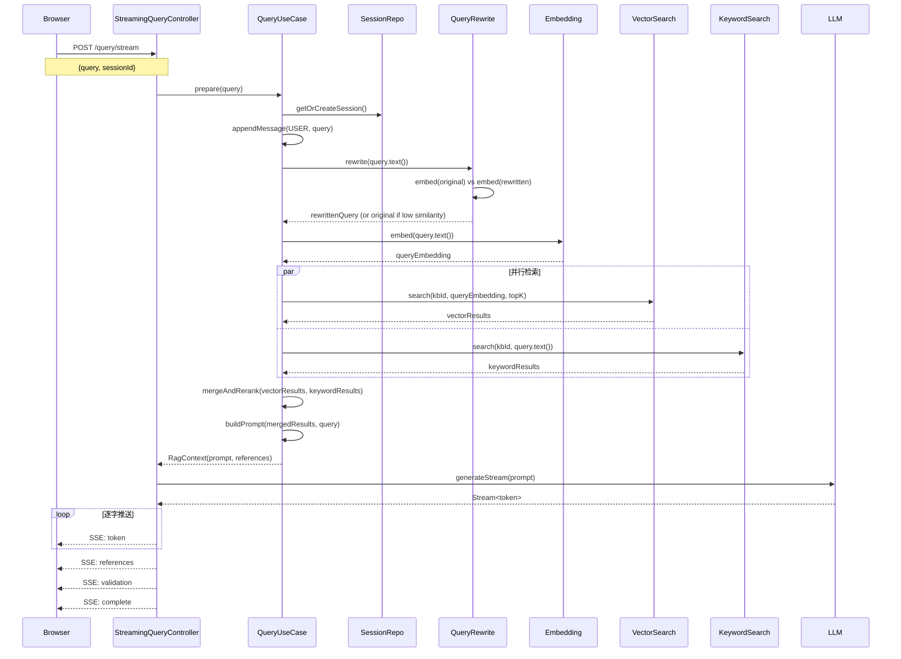

# 问答检索 —— 完整链路



## SSE 事件协议

```
event: session
data: {"sessionId": "xxx"}

event: token
data: {"token": "这"}

event: token
data: {"token": "个"}

event: token
data: {"token": "产"}

...

event: references
data: {"references": [{"id": 1, "text": "...", "source": "..."}]}

event: validation
data: {"trusted": true, "usedSourceIds": [1, 2]}

event: complete
data: {}
```

| 事件类型 | 时机 | 内容 |
|---------|------|------|
| `session` | 开始时 | 会话 ID |
| `token` | 每个字 | 生成的文本片段 |
| `references` | 生成完后 | 引用来源列表 |
| `validation` | 最后 | 引用校验结果 |
| `complete` | 结束时 | 空对象 |
| `error` | 出错时 | 错误信息 |

## 代码路径标注

| 步骤 | 代码位置 | 作用 |
|------|---------|------|
| 1 | `StreamingQueryController.java` | 接收 POST，返回 `Flux<ServerSentEvent>` |
| 2 | `StreamingQueryController.java` | `Mono.fromCallable + boundedElastic` 包装同步调用 |
| 3 | `KnowledgeBaseApplicationService.java:prepare()` | 获取/创建会话，保存用户消息 |
| 4 | `KnowledgeBaseApplicationService.java:prepare()` | `queryRewritePort.rewrite()` 改写问题 |
| 5 | `OllamaQueryRewriteAdapter.java` | embedding 相似度校验 |
| 6 | `KnowledgeBaseApplicationService.java:prepare()` | `embeddingPort.embed()` 问题向量化 |
| 7 | `KnowledgeBaseApplicationService.java:prepare()` | `CompletableFuture` 并行检索 |
| 8 | `MilvusVectorStoreAdapter.java:search()` | 向量相似度检索 |
| 9 | `MongoChunkSearchIndexAdapter.java:search()` | BM25 关键词检索 |
| 10 | `KnowledgeBaseApplicationService.java:prepare()` | `mergeAndRerank()` 融合排序 |
| 11 | `KnowledgeBaseApplicationService.java:prepare()` | `buildPrompt()` 组装 Prompt |
| 12 | `StreamingQueryController.java` | `streamingLlmPort.generateStream()` 流式生成 |
| 13 | `OllamaStreamingLlmAdapter.java` | LangChain4j 回调 → JDK Stream |
| 14 | `StreamingQueryController.java` | 包装成 SSE 事件逐字推送 |

## 本章自检清单

读完这一章，你应该能回答：

- [ ] 问答检索的完整流程是什么？
- [ ] SSE 有哪些事件类型？
- [ ] 为什么向量检索和关键词检索要并行执行？
- [ ] Query 改写的质量门禁是怎么工作的？
