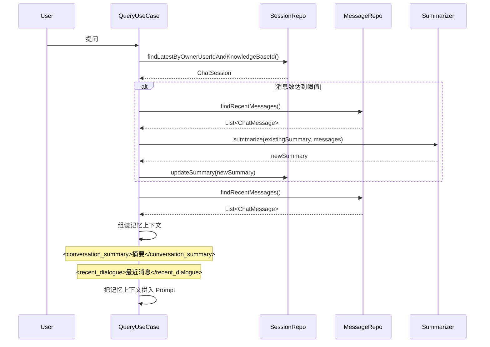

# 聊天记忆 —— 完整链路

## 记忆组装流程



## 记忆上下文格式

```
<conversation_summary>
用户之前询问了产品功能，系统介绍了主要特性。
</conversation_summary>

<recent_dialogue>
用户: 这个产品的主要功能是什么？
助手: 这个产品支持...
用户: 它的价格是多少？
</recent_dialogue>

基于以下参考资料回答用户问题：
[1] ...
[2] ...

用户问题：和竞品相比有什么优势？
```

## 摘要触发条件

```java
// 当未摘要消息数超过阈值时触发
long unsummarizedCount = session.getMessageCount() - session.getSummarizedUntilSequence();
if (unsummarizedCount >= summaryTriggerMessageCount) {
    summarizeIfNeeded(session);
}
```

**默认配置**：
- `summaryTriggerMessageCount` = 12（12 条消息后触发摘要）
- `recentMessageLimit` = 8（保留最近 8 条消息）
- `maxSummaryChars` = 1500（摘要最多 1500 字符）

## 本章自检清单

读完这一章，你应该能回答：

- [ ] 记忆上下文由哪两部分组成？
- [ ] 摘要什么时候触发？
- [ ] 为什么需要摘要，而不是保留全量历史？
