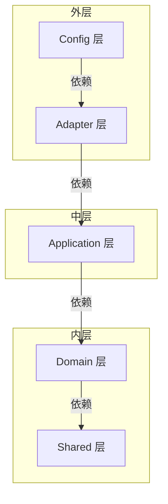

# 分层架构

Synapse 采用**六边形架构（Hexagonal Architecture）**，也叫**端口适配器模式（Ports and Adapters）**。它是一种分层架构，核心目标是：**业务逻辑不依赖任何具体技术**。

## 依赖方向

```
shared ← domain ← application ← adapter ← config ← bootstrap
```

这个箭头表示**依赖方向**：外层可以依赖内层，内层绝对不能依赖外层。



## 各层职责

### Domain 层（领域层）

**纯 Java，零框架依赖。**

- 实体（Entity）：`UserAccount`、`Document`、`ChatSession`
- 值对象（Value Object）：`UserId`、`DocumentId`
- 领域服务（Domain Service）：`RecursiveChunkingStrategy`
- 仓储接口（Repository Interface）：`UserAccountRepository`
- 异常：`DomainException`

Domain 层只关心业务规则：
- 用户名不能为空
- 密码哈希不能为空
- 文档状态只能按 PENDING → PROCESSING → COMPLETED 流转
- 分块大小不能超过 1000 字符

它不知道 Spring 是什么，不知道 MongoDB 是什么，不知道 HTTP 请求是什么。

### Application 层（应用层）

**用例编排，定义端口。**

- 入站端口（Driving Ports）：`*UseCase` 接口，定义在 `port/in/`
- 出站端口（Driven Ports）：`*Port` 接口，定义在 `port/out/`
- 应用服务（Application Service）：协调多个端口完成一个业务场景

Application 层不关心技术细节：
- 它知道有一个 `UserAccountRepository` 可以查用户，但不知道具体是 MongoDB 还是 MySQL
- 它知道有一个 `PasswordHasherPort` 可以哈希密码，但不知道具体是 BCrypt 还是 SCrypt
- 它知道有一个 `VectorStorePort` 可以存储向量，但不知道具体是 Milvus 还是 Pinecone

### Adapter 层（适配器层）

**技术实现。**

- 入站适配器（Inbound）：Controller 接收 HTTP 请求
- 出站适配器（Outbound）：Repository 实现、外部服务调用

Adapter 层引入所有具体技术：
- Spring WebFlux（Controller）
- Spring Data MongoDB（Repository）
- LangChain4j（LLM 调用）
- Milvus Client（向量存储）
- Sa-Token（权限会话）
- Apache Tika（文档解析）

### Config 层（配置层）

**Bean 组装。**

- `@Configuration` 创建没有 Spring 注解的 domain/application Bean
- 把 Application Service 和它的依赖（Repository 实现、Port 实现）组装起来
- 配置安全过滤器、初始化任务

Config 层不写业务逻辑，只做"接线"工作。

### Bootstrap 层（启动层）

**唯一 @SpringBootApplication。**

- 依赖 `synapse-auth-config` 和 `synapse-kb-config`
- 不直接创建业务对象

## 端口与适配器

### Driving Port（入站端口）

定义在 `application/port/in/`，命名 `*UseCase`。表示"系统对外提供的业务能力"。

```java
public interface AuthenticationUseCase {
    LoginResult login(LoginCommand command);
    void logout();
    CurrentUser currentUser();
}
```

谁来调用它？Controller（Web 适配器）。

### Driven Port（出站端口）

定义在 `application/port/out/`，命名 `*Port`。表示"系统需要外部提供的能力"。

```java
public interface PasswordHasherPort {
    String hash(String rawPassword);
    boolean matches(String rawPassword, String passwordHash);
}
```

谁来实现它？`BCryptPasswordHasherAdapter`（安全适配器）。

### "端口"命名的由来

想象一台电脑：
- **端口（Port）** 是接口定义：USB 口、HDMI 口、网线口
- **适配器（Adapter）** 是具体实现：USB 鼠标、HDMI 显示器、网线

Application 层定义"我需要什么能力"（端口），Adapter 层提供"具体怎么实现"（适配器）。这样 Application 层不依赖任何具体技术，可以随意替换适配器。

## Reactive 边界

WebFlux 是 Reactive 的（Mono/Flux），Application 层是同步的，两者通过桥接层协调。

```
[浏览器] ──HTTP──► [Controller: Mono/Flux]      ← WebFlux 非阻塞
                           │
                           ▼
                [SaTokenReactorBridge.blockingCall()]
                           │
                           ▼
                [Application Service: 同步]         ← 业务逻辑纯净
                           │
                           ▼
                [Adapter Out: Mono/Flux]            ← MongoDB、Ollama
                           │
                           ▼
                     .block()                        ← 桥接
```

### Application 层同步的设计原因

| 原因 | 说明 |
|------|------|
| **零框架依赖** | Domain 禁止引入 Spring、Reactor。如果 Application 返回 Mono，Domain 就被迫理解 Mono |
| **业务是决策流** | 查重 → 创建 → 保存 → 解析 → 分块 → 向量化 → 存储。严格串行，没有并行必要 |
| **Reactive 解决 I/O** | Controller、MongoDB、Ollama 都是 I/O。这些是 Adapter 的技术细节 |
| **可测试性** | 同步 API 的单元测试干净直接。Mono 需要 StepVerifier、调度器 |
| **依赖方向保护** | Application 依赖 Reactor 会破坏向内指向 Domain 的规则 |

Application Service 返回普通 Java 对象，Controller 用 `SaTokenReactorBridge.blockingCall()` 把它包装成 `Mono`。这样 Adapter 消化了技术复杂性，Application 只面对纯净的业务逻辑。
