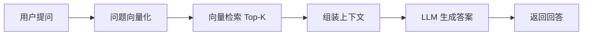
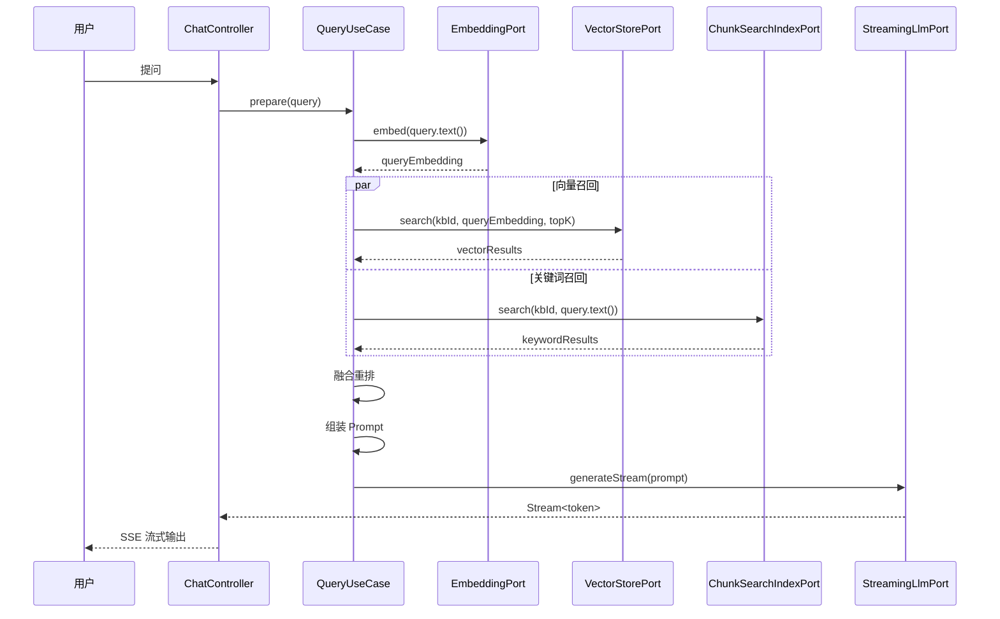

# RAG 检索增强生成

## 什么是 RAG

**RAG（Retrieval-Augmented Generation）** 是一种将信息检索与大语言模型生成相结合的技术。它不是直接让 LLM 凭记忆回答问题，而是先从知识库中检索相关内容，再把检索到的内容作为上下文提供给 LLM，让 LLM 基于这些资料生成答案。



## 为什么需要 RAG

### 大语言模型的局限性

1. **知识截止**：LLM 的训练数据有截止时间，不知道最新信息
2. **幻觉问题**：模型可能一本正经地编造不存在的信息
3. **领域知识缺失**：通用模型对企业内部知识一无所知

### RAG 的优势

| 对比项 | 纯 LLM | RAG |
|--------|--------|-----|
| 知识时效性 | 受训练数据限制 | 实时检索最新文档 |
| 准确性 | 可能幻觉 | 基于检索内容，可溯源 |
| 领域适配 | 需要微调 | 直接接入领域文档 |
| 成本 | 微调成本高 | 仅需向量存储和检索 |

## Synapse 中的 RAG 流程

### 完整链路



### 1. Query 改写与质量门禁

用户原始问题可能不够精确，系统会尝试改写问题以获得更好的检索效果。但改写结果必须通过 embedding 余弦相似度校验（默认阈值 `0.8`），未通过时自动回退原 query。

### 2. 混合检索

Synapse 使用两种检索方式并行执行：

- **向量召回（Milvus）**：基于语义相似度，找到与用户问题意思相近的文档片段
- **关键词召回（MongoDB BM25）**：基于关键词匹配，找到包含用户问题关键词的文档片段

两种结果通过融合算法合并，兼顾语义理解和精确匹配。

### 3. Prompt 构建

检索到的片段会被格式化为带编号的引用：

```
基于以下参考资料回答用户问题：

[1] 片段内容 A...
[2] 片段内容 B...
[3] 片段内容 C...

用户问题：{question}

请基于以上参考资料回答，如果资料不足以回答，请准确说明。
```

<Tip>
  Prompt 模板从 `application.yaml` 读取，支持外部配置和自定义。
</Tip>

### 4. 引用溯源

每个检索片段分配 `sourceId`，LLM 回答时使用 `[1]` 形式引用来源。后端会对引用编号做确定性校验，并通过 SSE `validation` 事件返回可信状态。

## 常见误区

| 误区 | 正确理解 |
|------|---------|
| 只取第一个检索结果给 LLM | RAG 的核心是把 **Top-K 所有片段** 一起给 LLM 当上下文 |
| 检索结果"也给前端看看" | 检索结果有两个用途：给 LLM 当上下文 + 给前端当引用来源 |
| Prompt 构建是技术细节 | Prompt 怎么拼是业务决策，属于 Application 层 |
