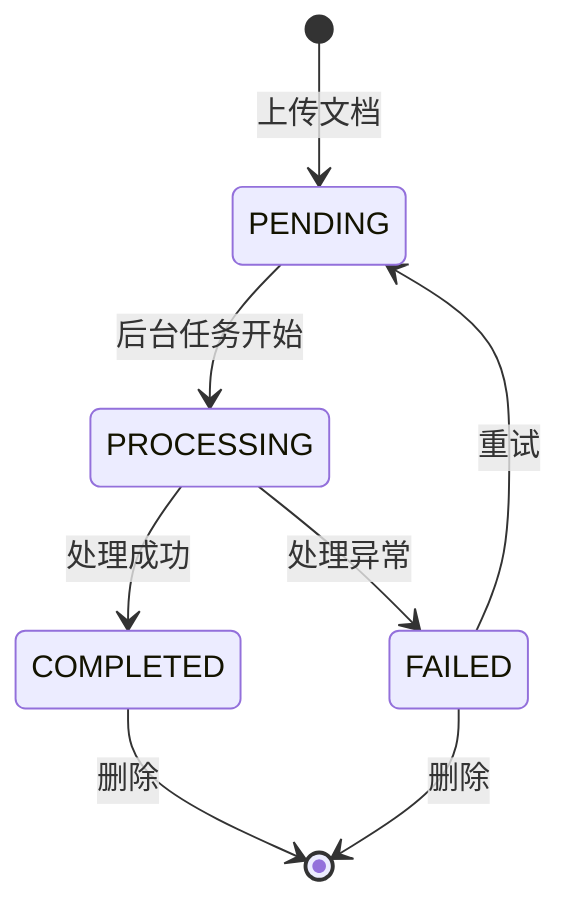
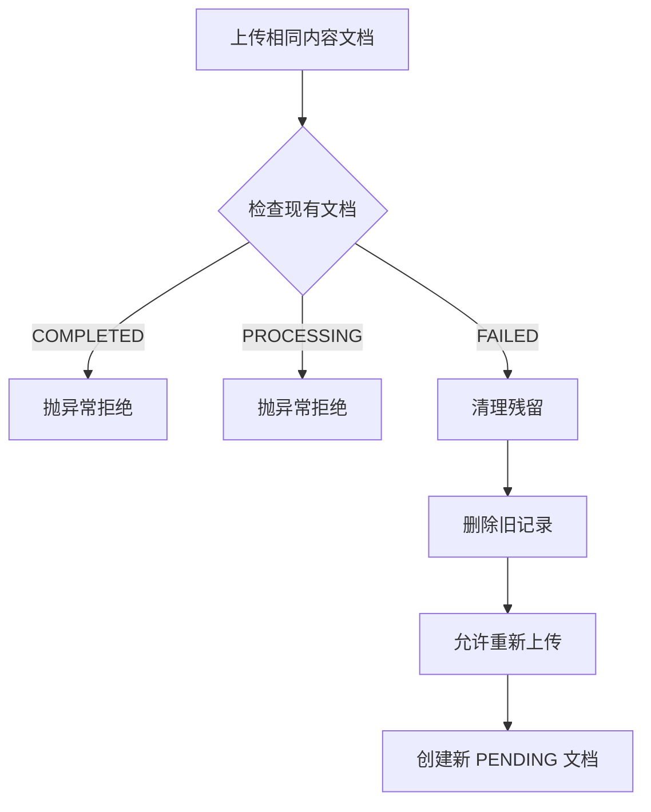
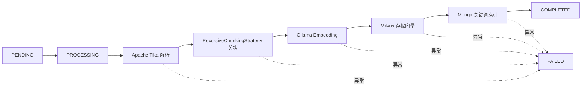

# 文档状态机

## 状态定义

Document 有四种状态：

| 状态 | 说明 |
|------|------|
| `PENDING` | 已创建，等待后台摄入 |
| `PROCESSING` | 正在解析、语义分块、向量化并写入 Milvus 与 Mongo 关键词索引 |
| `COMPLETED` | 摄入完成，可用于问答 |
| `FAILED` | 摄入失败，可重新上传同内容触发清理后重试 |

## 状态流转图



## 状态转换规则

```java
private static final Map<DocumentStatus, Set<DocumentStatus>> VALID_TRANSITIONS = Map.of(
    DocumentStatus.PENDING,     EnumSet.of(DocumentStatus.PROCESSING),
    DocumentStatus.PROCESSING,  EnumSet.of(DocumentStatus.COMPLETED, DocumentStatus.FAILED),
    DocumentStatus.FAILED,      EnumSet.of(DocumentStatus.PENDING),
    DocumentStatus.COMPLETED,   EnumSet.noneOf(DocumentStatus.class)
);
```

| 当前状态 | 允许转到 | 触发条件 |
|---------|---------|---------|
| `PENDING` | `PROCESSING` | 后台摄入任务开始 |
| `PROCESSING` | `COMPLETED` | 解析、分块、向量化、存储全部成功 |
| `PROCESSING` | `FAILED` | 任何步骤抛出异常 |
| `FAILED` | `PENDING` | 用户点击重试 |
| `COMPLETED` | — | 终态，不能再转 |

## 查重与上传逻辑

上传时系统会计算文档内容的 SHA-256 哈希进行查重：

### 为什么用 contentHash 不用 fileName？

| 场景 | 用 fileName | 用 contentHash |
|------|------------|---------------|
| 同一文件改个名字再传 | 重复入库 | 正确拒绝 |
| 不同文件恰好同名 | 错误拒绝 | 正确允许 |
| 文件内容修改后再传 | 允许 | 允许（哈希变了） |

### 三种已有状态的处理



| 已有状态 | 处理 |
|---------|------|
| `COMPLETED` | 直接拒绝。已完整解析、分块、向量化、入库，重复上传无意义 |
| `PROCESSING` | 直接拒绝。正在处理中，防止并行处理造成重复向量 |
| `FAILED` | 清理残留后允许重试。先删向量（Milvus），再删元数据（MongoDB），然后重新上传 |

<Danger>
  清理顺序不能反：必须先删向量（Milvus），再删元数据（MongoDB）。如果先删元数据，向量残留就变成**"无头向量"**——永远清理不掉，还可能在检索时干扰结果。
</Danger>

## 后台摄入流程



## MongoDB 索引

```yaml
# 知识库归属索引
knowledgeBase.ownerUserId

# 文档关联索引
document.knowledgeBaseId
document.uploadedAt

# 内容去重唯一索引
document.knowledgeBaseId + contentHash

# 关键词检索索引
document_chunk_index.knowledgeBaseId + tokens

# 聊天会话索引
chat_sessions.ownerUserId + knowledgeBaseId + updatedAt

# 消息顺序唯一索引
chat_messages.sessionId + sequence
```
