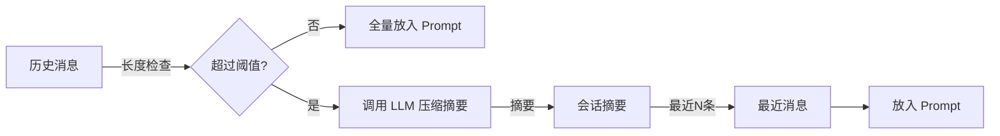

# 聊天记忆机制

## 会话隔离模型

聊天会话按 **当前用户 + 知识库** 隔离。即使拥有同一个知识库访问权，也不能读取其他用户的会话。

```
用户 A + 知识库 1 → 会话 A-1（独立）
用户 A + 知识库 2 → 会话 A-2（独立）
用户 B + 知识库 1 → 会话 B-1（独立，A 不可见）
```

## 消息存储结构

```java
public record ChatMessage(
    String id,
    String sessionId,
    MessageRole role,         // USER / ASSISTANT
    String content,
    List<ChunkReference> references,
    int sequence,             // 会话内严格递增
    Instant createdAt
) {}
```

MongoDB 索引：`chat_messages.sessionId + sequence` 唯一索引，保证消息顺序。

## 聊天记忆策略

### 为什么不能把全量历史直接放入 Prompt？

LLM 有上下文长度限制（qwen2.5:7b 约 32K tokens）。如果对话很长，全量历史会：

1. 挤占检索片段的上下文空间
2. 增加 token 消耗
3. 降低生成质量

### Synapse 的记忆压缩策略



1. **检查消息数量**：超过阈值时触发压缩
2. **调用 LLM 摘要**：将旧历史压缩为一段摘要文本
3. **携带摘要 + 最近消息**：Prompt 中包含摘要和最近 N 条完整消息

## 消息生命周期

### 用户提问时

```
1. 接收用户问题
2. 保存用户消息到数据库
3. 获取会话摘要 + 最近消息
4. 组装 Prompt（摘要 + 最近消息 + 检索片段 + 当前问题）
5. 调用 LLM 生成答案
6. 保存助手消息到数据库
7. 返回 SSE 流式输出
```

### 异常处理

- 如果生成失败，**不保存**半截的助手回复
- 用户消息已保存，下次重试时不会丢失上下文

## API 设计

### 获取当前会话

```http
GET /api/knowledge-bases/{kbId}/chat/sessions/current
synapse-token: <tokenValue>
```

若当前用户在该知识库下没有会话，后端自动创建。

### 新建会话

```http
POST /api/knowledge-bases/{kbId}/chat/sessions
synapse-token: <tokenValue>
```

### 分页读取消息

```http
GET /api/chat/sessions/{sessionId}/messages?page=0&size=50
synapse-token: <tokenValue>
```

<Warning>
  聊天会话和消息 API 必须校验当前用户为 ownerUserId，不得因 ADMIN 权限泄露其他用户记忆。
</Warning>

## 安全边界

1. **用户隔离**：`ownerUserId` 校验，防止越权访问
2. **知识库隔离**：会话按 `knowledgeBaseId` 隔离
3. **ADMIN 不越界**：即使 ADMIN 有所有权限，也不能读取其他用户的聊天历史
