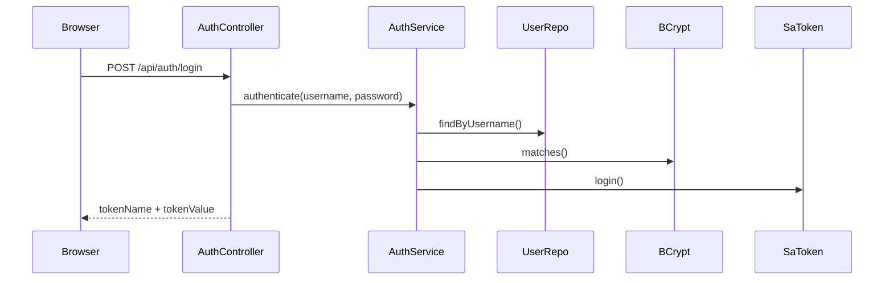
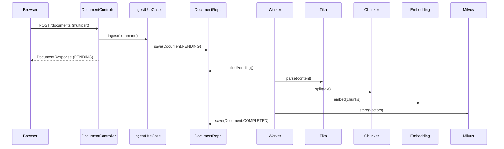
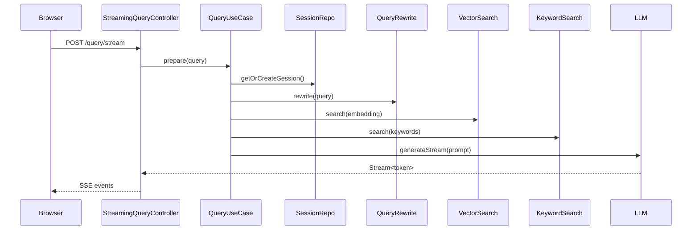

# 系统架构

## 模块结构

```
synapse/
├── synapse-shared/              # 共享内核（DomainException）
├── synapse-auth-domain/         # 认证领域层 —— 用户、角色、权限
├── synapse-auth-application/    # 认证应用层 —— 登录、当前用户、用户/角色管理
├── synapse-auth-adapter/        # 认证适配器层 —— Web、Mongo、Sa-Token、BCrypt
├── synapse-auth-config/         # 认证 Bean 组装与安全过滤器
├── synapse-kb-domain/           # 知识库领域层 —— 纯 Java，零框架依赖
├── synapse-kb-application/      # 知识库应用层 —— 用例编排，定义端口
├── synapse-kb-adapter/          # 知识库适配器层 —— Web、Mongo、Milvus、Ollama、Tika
├── synapse-kb-config/           # 知识库 Bean 组装
├── synapse-kb-bootstrap/        # Spring Boot 启动入口
└── synapse-frontend/            # Vue 3 + Vite + Pinia 前端
```

## 依赖方向

```
shared ← domain ← application ← adapter ← config ← bootstrap
```

`auth` 与 `kb` 是并列的 **Bounded Context**。`kb-application` 只能通过 `AccessControlPort` 依赖权限能力，具体 Sa-Token 实现在 `auth-adapter` 中提供。

<Warning>
  外层模块可以依赖内层，内层模块**绝对不能**依赖外层。Domain 层是核心，没有任何外部依赖。
</Warning>

## 分层规范

### Domain 层

- **纯 Java**，禁止引入 `org.springframework.*`、`dev.langchain4j.*`、`reactor-core`
- **充血模型**，Entity 包含业务方法和校验逻辑
- **值对象**使用 Java `record` 或 final class，不可变
- **仓储接口**只定义接口，返回 `Optional<Aggregate>` 或同步集合

### Application 层

- **用例编排**，协调多个端口完成一个业务场景
- **入站端口（Driving Ports）**命名 `*UseCase`，定义在 `port/in/` 下
- **出站端口（Driven Ports / SPI）**命名 `*Port`，定义在 `port/out/` 下
- **同步 API**，返回领域对象，不返回 `Mono`/`Flux`

### Adapter 层

- **入站适配器**：WebFlux Controller 返回 `Mono<>` / `Flux<>`
- Controller 调用同步 application 服务时使用 Sa-Token Reactor 上下文桥接
- **出站适配器**：实现 application/domain 层端口
- MongoDB 使用同步 Spring Data MongoDB 仓储
- LangChain4j、Ollama、Milvus、Tika、Sa-Token、BCrypt 仅限 adapter 层

### Config 层

- **Bean 组装**：`@Configuration` 创建无 Spring 注解的 domain/application Bean
- 可放启动安全过滤器和初始化任务；不写业务流程

## 核心数据流

### 登录与权限



### 文档摄入



### 流式问答



## 端口清单

### 认证入站端口

| 端口 | 职责 |
|------|------|
| `AuthenticationUseCase` | 登录、登出、当前用户 |
| `UserAdminUseCase` | 用户管理、角色绑定、角色权限管理 |

### 认证出站端口

| 端口 | 当前实现 |
|------|---------|
| `PasswordHasherPort` | `BCryptPasswordHasherAdapter` |
| `LoginSessionPort` | `SaTokenLoginSessionAdapter` |
| `UserAccountRepository` | `MongoUserAccountRepository` |
| `RoleDefinitionRepository` | `MongoRoleDefinitionRepository` |

### 知识库入站端口

| 端口 | 职责 |
|------|------|
| `CreateKnowledgeBaseUseCase` | 创建知识库 |
| `ListKnowledgeBaseUseCase` | 列出可访问知识库 |
| `DeleteKnowledgeBaseUseCase` | 删除知识库及其文档/向量 |
| `IngestDocumentUseCase` | 创建 `PENDING` 文档并提交异步摄入 |
| `ListDocumentUseCase` | 列出知识库文档 |
| `DeleteDocumentUseCase` | 删除文档及向量 |
| `QueryKnowledgeBaseUseCase` | 检索并组装 RAG prompt |

### 知识库出站端口

| 端口 | 当前实现 |
|------|---------|
| `AccessControlPort` | `SaTokenKbAccessControlAdapter` |
| `VectorStorePort` | `MilvusVectorStoreAdapter` |
| `ChunkSearchIndexPort` | `MongoChunkSearchIndexAdapter` |
| `EmbeddingPort` | `OllamaEmbeddingAdapter` |
| `QueryRewritePort` | `OllamaQueryRewriteAdapter` |
| `StreamingLlmPort` | `OllamaStreamingLlmAdapter` |
| `DocumentParserPort` | `ApacheTikaDocumentParserAdapter` |
| `KnowledgeBaseRepository` | `MongoKnowledgeBaseRepository` |
| `DocumentRepository` | `MongoDocumentRepository` |
