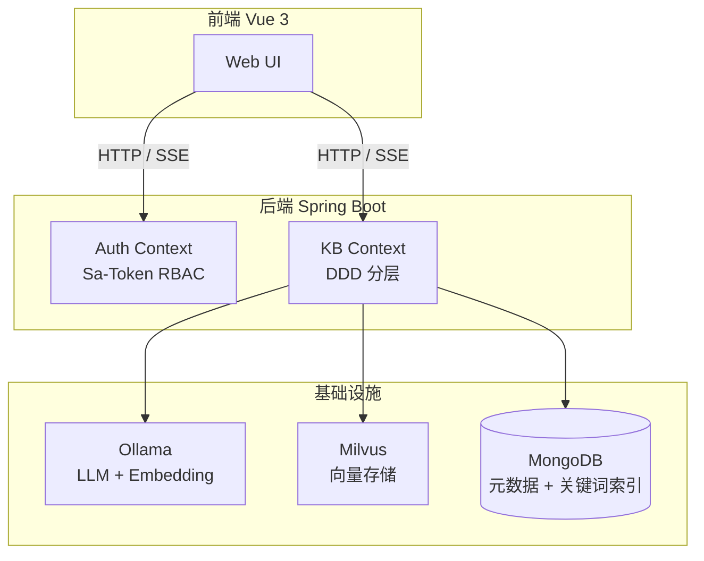

# Synapse

Synapse 是一个面向企业的多知识库 **RAG（Retrieval-Augmented Generation）** 系统。它允许用户创建多个独立的知识库，上传文档（PDF、Word、TXT、Markdown 等），然后通过自然语言问答的方式与知识库进行交互。

## 核心特性

- **多知识库隔离**：每个知识库独立管理文档和向量数据，严格的用户归属隔离
- **完整 RBAC 权限**：基于 Sa-Token 的角色权限控制，支持 `USER` 和 `ADMIN` 角色
- **异步文档摄入**：上传后立即返回，后台完成解析、分块、向量化全流程
- **混合检索**：Milvus 向量召回 + MongoDB BM25 关键词召回，融合重排
- **Query 改写质量门禁**：通过 embedding 余弦相似度校验改写质量，保障检索准确性
- **SSE 流式问答**：打字机效果实时输出，支持引用溯源
- **聊天记忆**：会话历史压缩摘要，支持多轮对话上下文

## 系统架构概览

## 适用场景

- **企业内部知识管理**：产品手册、技术文档、规章制度的统一检索与问答
- **个人知识库**：论文、笔记、资料的整理与智能检索
- **客服辅助**：基于文档的自动问答，降低人工客服成本

## 快速导航

<CardGroup cols={2}>
  <Card title="快速开始" icon="rocket" href="/introduction/quickstart">
    5 分钟搭建本地开发环境
  </Card>
  <Card title="系统架构" icon="building" href="/introduction/architecture">
    了解模块划分、分层设计和数据流
  </Card>
  <Card title="使用指南" icon="book-open" href="/guides/authentication">
    学习认证、知识库管理、文档上传和问答
  </Card>
  <Card title="API 参考" icon="code" href="/api-reference/overview">
    完整的 HTTP API 接口文档
  </Card>
</CardGroup>
