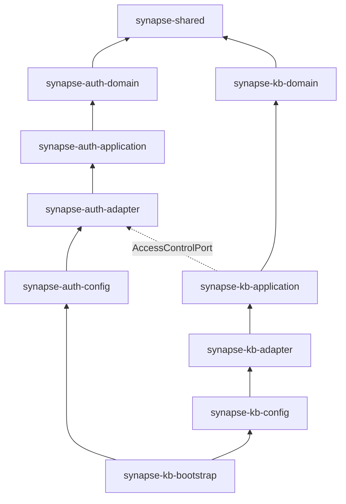

# 技术栈

## 后端技术栈

| 层级 | 技术 | 版本 | 用途 |
|------|------|------|------|
| 框架 | Spring Boot | 3.5.13 | 应用框架 |
| 响应式 Web | Spring WebFlux | - | 非阻塞 HTTP 入口 |
| 鉴权 | Sa-Token Reactor | 1.45.0 | RBAC 权限控制 |
| AI 编排 | LangChain4j | 1.13.0 | LLM 抽象与编排 |
| LLM | Ollama | - | 本地大模型推理 |
| Embedding | Ollama | - | 文本向量化 |
| 向量存储 | Milvus | 2.3+ | 向量检索 |
| 元数据存储 | MongoDB | 6.0+ | 文档元数据、关键词索引 |
| 文档解析 | Apache Tika | - | 多格式文档解析 |
| 构建工具 | Maven | 3.9+ | 依赖管理 |
| JDK | Java | 21 | 运行环境 |

## 前端技术栈

| 技术 | 版本 | 用途 |
|------|------|------|
| Vue | 3 | 前端框架 |
| Vite | 5+ | 构建工具 |
| Pinia | - | 状态管理 |
| Vue Router | 4 | 路由管理 |
| Axios | - | HTTP 客户端 |

## 模型配置

| 模型 | 用途 | 维度 |
|------|------|------|
| `qwen2.5:7b` | 问答生成、聊天记忆压缩 | - |
| `gme-Qwen2-VL-2B-Instruct-GGUF:Q8_0` | 文本向量化 | 1536 |

<Tip>
  模型配置可在 `application.yaml` 中修改，支持切换为其他 Ollama 兼容模型。
</Tip>

## 模块依赖关系

依赖方向严格遵循 **向内指向 Domain** 的原则：`shared ← domain ← application ← adapter ← config ← bootstrap`。
