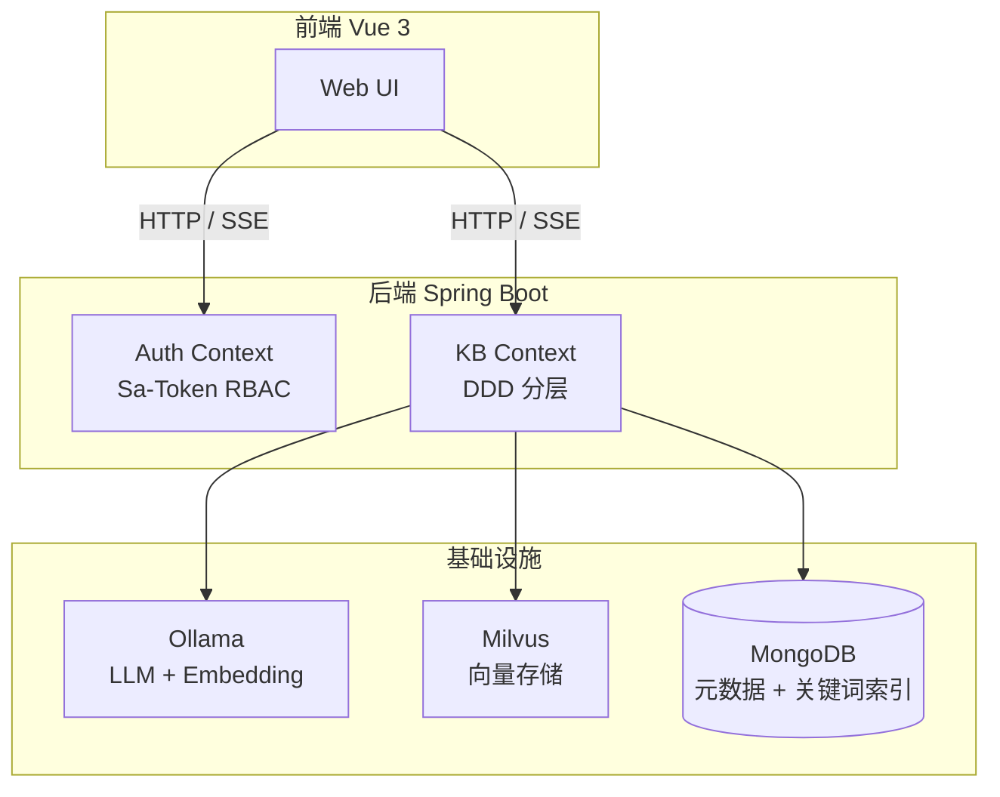

# Synapse

Synapse 是一个面向企业的**多知识库 RAG（Retrieval-Augmented Generation）系统**。支持创建多个独立的知识库，上传文档（PDF、Word、TXT、Markdown），通过自然语言问答与知识库交互。

## 核心特性

- **多知识库隔离**：每个知识库独立管理文档和向量数据，严格的用户归属隔离
- **完整 RBAC 权限**：基于 Sa-Token 的角色权限控制，支持 `USER` 和 `ADMIN` 角色
- **异步文档摄入**：上传后立即返回，后台完成解析、分块、向量化全流程
- **资料时效性治理**：文档携带生效期、版本链、生命周期状态，检索时按 asOfDate 硬过滤，避免引用过期法规
- **混合检索**：Milvus 向量召回 + MongoDB BM25 关键词召回，融合重排
- **Query 改写质量门禁**：通过 embedding 余弦相似度校验改写质量，保障检索准确性
- **SSE 流式问答**：实时流式输出，支持引用溯源
- **聊天记忆**：会话历史压缩摘要，支持多轮对话上下文

## 系统架构概览

## 文档导航

<CardGroup cols={2}>
  <Card title="快速上手" icon="rocket" href="/getting-started/quickstart">
    本地开发环境搭建与启动
  </Card>
  <Card title="核心概念" icon="lightbulb" href="/concepts/rag">
    RAG、向量检索、DDD、分层架构、状态机
  </Card>
  <Card title="认证登录" icon="code" href="/auth/overview">
    认证流程、UserAccount 实体、RBAC、Sa-Token 集成
  </Card>
  <Card title="文档摄入" icon="file" href="/ingestion/overview">
    异步处理、状态机、Worker 轮询、双写索引
  </Card>
  <Card title="问答检索" icon="message" href="/query/overview">
    SSE 流式、混合检索、Prompt 工程、引用校验
  </Card>
  <Card title="聊天记忆" icon="history" href="/chat/overview">
    会话管理、摘要压缩、消息持久化
  </Card>
  <Card title="设计深入" icon="book-open" href="/design/domain-patterns">
    领域模式、端口设计、Reactive 桥接、分块算法
  </Card>
  <Card title="API 参考" icon="code" href="/reference/api/auth">
    完整接口文档，含 curl 示例
  </Card>
</CardGroup>

## 适用场景

- **企业内部知识管理**：产品手册、技术文档、规章制度的统一检索与问答
- **法规政策知识库**：支持法规版本链管理、生效期硬过滤、历史版本追溯
- **个人知识库**：论文、笔记、资料的整理与智能检索

## 技术栈速览

| 层级 | 技术 | 版本 |
|------|------|------|
| 后端框架 | Spring Boot + WebFlux | 3.5.13 |
| 鉴权 | Sa-Token Reactor | 1.45.0 |
| AI 编排 | LangChain4j | 1.13.0 |
| LLM / Embedding | Ollama | qwen2.5:7b / gme-Qwen2-VL-2B |
| 向量存储 | Milvus | 2.3+ |
| 元数据存储 | MongoDB | 6.0+ |
| 文档解析 | MinerU / Apache Tika | MinerU 本地服务，Tika fallback |
| 前端 | Vue 3 + Vite + Pinia | — |
| 构建工具 | Maven | Java 21 |
