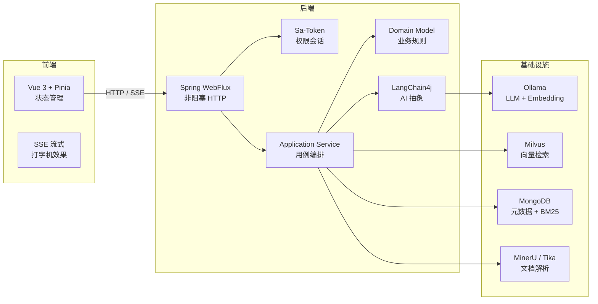

# 技术栈

## 总览

| 技术 | 版本 | 在这个项目里负责什么 |
|------|------|---------------------|
| Java | 21 | 运行环境，虚拟线程支撑高并发 |
| Spring Boot | 3.5.13 | 后端框架，自动配置、依赖注入 |
| Spring WebFlux | — | Reactive Web 框架，非阻塞 I/O |
| Sa-Token | 1.45.0 | 登录会话、RBAC 权限控制 |
| LangChain4j | 1.13.0 | AI 编排框架，封装 LLM 和 Embedding 调用 |
| Ollama | 最新 | 本地运行 LLM 和 Embedding 模型 |
| Milvus | 2.3+ | 向量数据库，存储和检索文档向量 |
| MongoDB | 6.0+ | 元数据存储、关键词倒排索引 |
| MinerU | 3.1.x | PDF 版面、表格、公式解析，本地独立服务 |
| Apache Tika | — | 内置轻量解析和 MinerU 失败 fallback |
| Vue 3 | — | 前端框架 |
| Vite | — | 前端构建工具 |
| Pinia | — | 前端状态管理 |
| Maven | — | Java 构建工具 |

---

## Java 21

Java 21 替代 Java 17 的原因

Java 21 引入了**虚拟线程（Virtual Threads）**，这是本项目选择它的核心原因。

传统线程（平台线程）创建成本高，一台服务器通常只能开几千个。虚拟线程由 JVM 管理，可以创建上百万个，开销极低。在我们的场景里：

- 文档摄入 Worker 用虚拟线程池执行后台任务
- Ollama 流式生成用虚拟线程消费 LLM 回调
- 每个 SSE 连接都是轻量的虚拟线程

```java
// 虚拟线程池：创建成本极低
Executors.newVirtualThreadPerTaskExecutor()
```

## Spring Boot + WebFlux

WebFlux 替代 Spring MVC 的原因

Spring MVC 是阻塞式的：一个请求占用一个线程，线程等待数据库或 LLM 响应时什么都干不了。WebFlux 是非阻塞的：线程不等待，数据准备好后通过回调通知你。

在我们的项目里，SSE（Server-Sent Events）流式问答需要长连接。如果用 MVC，一个用户提问就占用一个线程十几秒，并发一高线程池就耗尽。WebFlux 用少量线程处理大量连接，完美解决这个问题。

但 WebFlux 带来了复杂度：**Sa-Token 是同步 API，WebFlux 是异步的，需要一个桥接层**。这个项目完整展示了如何处理这种"同步库 + 异步框架"的场景。

```
[浏览器] --HTTP--> [Controller: Mono/Flux]     ← WebFlux 非阻塞
                         │
                         ▼
              [SaTokenReactorBridge.blockingCall()] ← 桥接到弹性线程池
                         │
                         ▼
              [Application Service: 同步]            ← 业务逻辑纯净
```

---

## Sa-Token

Sa-Token 替代 Spring Security 的原因

Spring Security 功能强大但配置复杂，学习曲线陡峭。Sa-Token 是一个国产的轻量级权限框架，核心概念只有三个：

- **登录**：`StpUtil.login(userId)`
- **检查登录**：`StpUtil.checkLogin()`
- **检查权限**：`StpUtil.checkPermission("AUTH_ADMIN")`

它原生支持分布式会话、RBAC 权限模型，而且有 Reactor 版本（Sa-Token Reactor），可以和 WebFlux 配合。

在本项目中，Sa-Token 负责：
- 登录会话管理（Token 生成、验证、续期）
- RBAC 权限控制（角色 → 权限的映射）
- 路由级别的登录拦截

---

## LangChain4j

**LangChain4j 的作用**

LangChain4j 是 Java 版的 LangChain，封装了与各种 LLM 和 Embedding 模型的交互。没有它，你需要自己写：

- HTTP 调用 Ollama API
- 解析 SSE 流式响应
- 管理 Embedding 模型的输入输出格式
- 处理重试、熔断、超时

LangChain4j 提供了统一的抽象：

```java
// 聊天模型：统一的 ChatLanguageModel 接口
ChatLanguageModel model = OllamaChatModel.builder()
    .baseUrl("http://localhost:11434")
    .modelName("qwen2.5:7b")
    .build();

// Embedding 模型：统一的 EmbeddingModel 接口
EmbeddingModel embedder = OllamaEmbeddingModel.builder()
    .baseUrl("http://localhost:11434")
    .modelName("hf.co/sinequa/gme-Qwen2-VL-2B-Instruct-GGUF:Q8_0")
    .build();
```

> 注意：本项目**只在 Adapter 层**使用 LangChain4j。Domain 和 Application 层完全不感知它的存在，这是分层架构的要求。

---

## Ollama

本地部署替代 OpenAI API 的原因

三个原因：

1. **数据隐私**：企业文档不上云
2. **成本可控**：没有按 token 计费
3. **离线可用**：不需要网络连接

Ollama 让在本地运行大模型变得极其简单：

```bash
ollama pull qwen2.5:7b      # 下载对话模型
ollama pull hf.co/sinequa/gme-Qwen2-VL-2B-Instruct-GGUF:Q8_0 # 下载 Embedding 模型
ollama serve                 # 启动服务
```

本项目中，Ollama 同时充当两个角色：
- **LLM**：生成回答文本（qwen2.5:7b）
- **Embedding 模型**：把文本变成向量（gme-Qwen2-VL-2B，1536 维）

---

## Milvus

**向量数据库的作用**

传统数据库按精确值查询（`WHERE id = 123`）。向量数据库按**相似度**查询：给定一个向量，找出数据库中最接近的 N 个向量。

在 RAG 中，我们把文档切成小段，每段文本通过一个 Embedding 模型变成一个 1536 维的向量。用户提问时也变成向量。然后在 Milvus 中搜索"哪些文档片段的向量最接近问题向量"——这就是**语义检索**。

Milvus 使用 **HNSW（Hierarchical Navigable Small World）** 索引，这是一种近似最近邻（ANN）算法，可以在海量向量中快速找到相似的向量，牺牲少量精度换取极高的查询速度。

---

## MongoDB

**元数据 + 关键词索引的选型原因**

MongoDB 在这个项目里承担两个职责：

1. **元数据存储**：知识库、文档、用户、聊天会话等结构化数据
2. **BM25 关键词索引**：自建倒排索引，支持基于关键词的文本检索

自建 BM25 索引替代 MongoDB 文本搜索的原因

MongoDB 的 `$text` 索引对中文支持不佳（基于空格分词），且 BM25 评分精度更高。我们自研了一套轻量 BM25 实现：
- 中文按单字/双字分词
- 英文按词分词
- 维护文档频率缓存
- 实时计算 TF-IDF 评分

这样，向量检索（找语义相近）和关键词检索（找字面匹配）形成互补，通过融合算法得到更准确的最终结果。

---

## MinerU + Apache Tika

**文档解析的分层方式**

Synapse 通过 `DocumentParserPort` 抽象文档解析能力，Application 层只关心“输入文件流，输出文本”。具体 provider 由配置选择：

- `mineru`：调用外部 `mineru-api`，当前默认配置，用于提升 PDF、表格、公式和复杂版面的解析质量
- `tika`：使用 Java 进程内 Apache Tika，适合轻量解析，也作为 MinerU 不可用时的 fallback

MinerU 作为独立 Python 服务部署在 Synapse 仓库之外，例如 `/Users/admin/codeProject/mineru`。模型缓存固定在 MinerU 目录下，不进入 Java 进程，也不提交到 Git。

```yaml
synapse:
  parser:
    provider: mineru
    mineru:
      base-url: http://127.0.0.1:8000
      backend: pipeline
      fallback-to-tika: true
```

> 注意：MinerU 解析模型与 Ollama 的 `qwen2.5:7b` 问答模型是两条链路。`qwen2.5:7b` 继续用于问答生成，不用于 MinerU pipeline 文档解析。

---

## Vue 3 + Pinia

**前端状态管理的设计**

Vue 3 的 Composition API 让状态逻辑可以复用。Pinia 是 Vue 官方推荐的状态管理库，比 Vuex 更简洁。

本项目前端的核心设计：

- **`auth.ts`**：登录态、用户信息、权限判断
- **`knowledgeBase.ts`**：知识库列表、当前选中知识库
- **`document.ts`**：文档列表、上传状态、轮询刷新
- **`chat.ts`**：消息列表、SSE 流式接收、竞态防护、Token 缓冲

最复杂的是 `chat.ts`：需要处理 SSE 流式数据的接收、打字机效果的渲染、引用来源的展示、以及"停止生成"的取消逻辑。

---

## 技术之间的关系图


